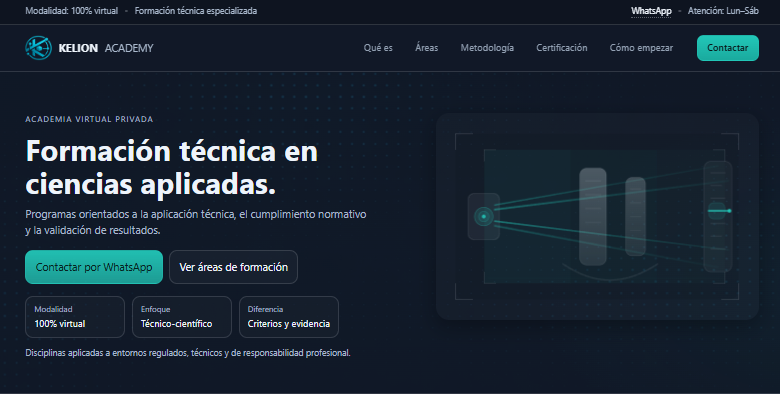
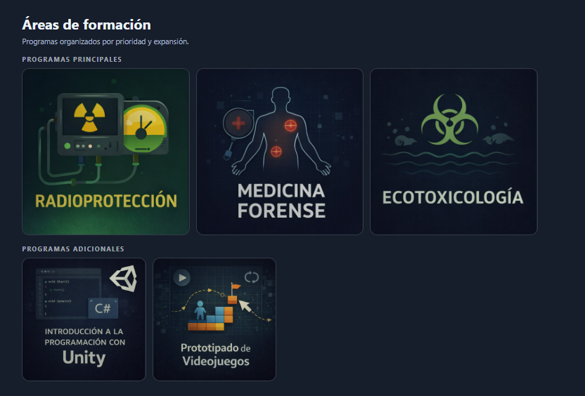
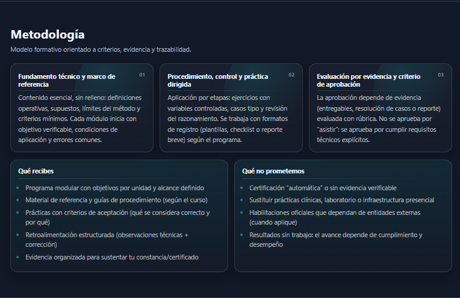

# KELION ACADEMY

🌐 Live Demo: https://nezash.github.io/kelion-academy/

Web-based institutional platform for a technical academy focused on structured training, validation, and professional application.

---

---

## Descripción

Sitio web institucional de KELION ACADEMY, una academia privada orientada a formación técnica especializada en modalidad virtual.

El proyecto presenta una estructura formativa basada en criterios técnicos, evidencia verificable y aplicación profesional en contextos regulados.

---

## Enfoque

- Formación basada en criterios técnicos y evidencia  
- Aplicación en contextos reales y regulados  
- Evaluación estructurada bajo condiciones verificables  

---

## Funcionalidades

- Navegación estructurada por áreas de formación  
- Presentación de programas técnicos especializados  
- Organización del contenido por prioridad y enfoque  
- Interfaz clara orientada a comunicación institucional  

---

## Preview

### Áreas de formación

### Metodología

---

## Tecnologías

- HTML  
- CSS  
- JavaScript (vanilla)  
- GitHub Pages  

---

## Deployment

Deployed using GitHub Pages.

---

## Estado

Versión inicial funcional del sitio institucional.